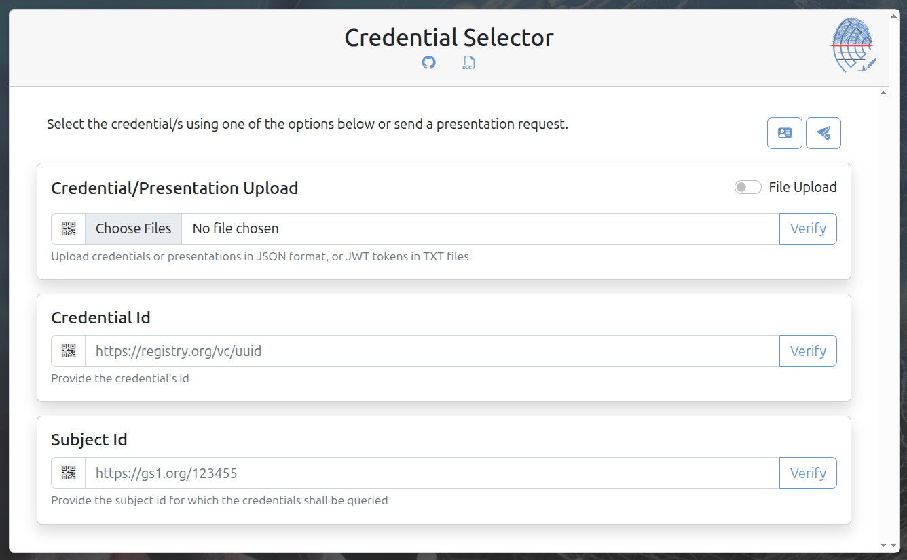
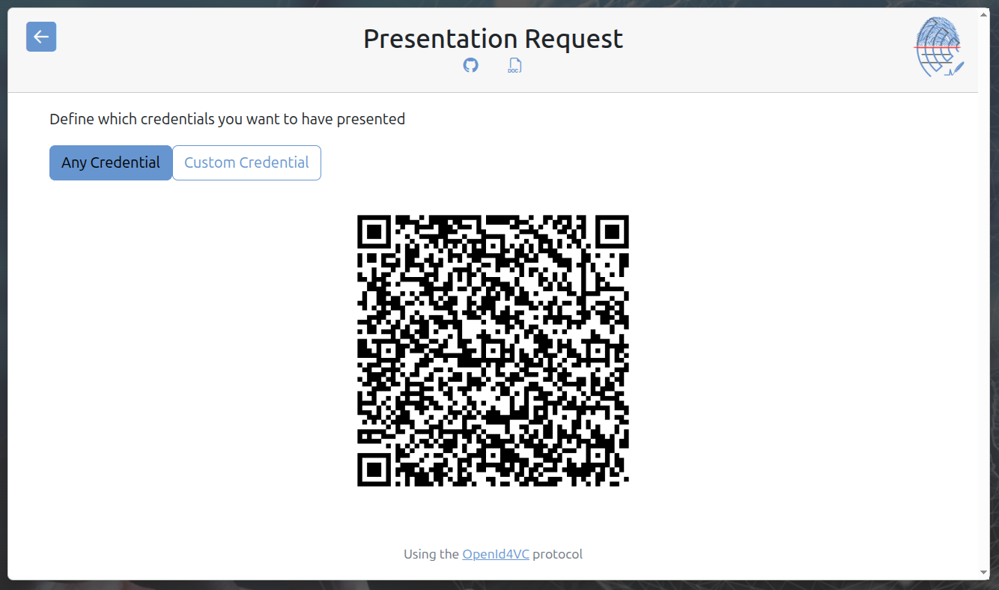
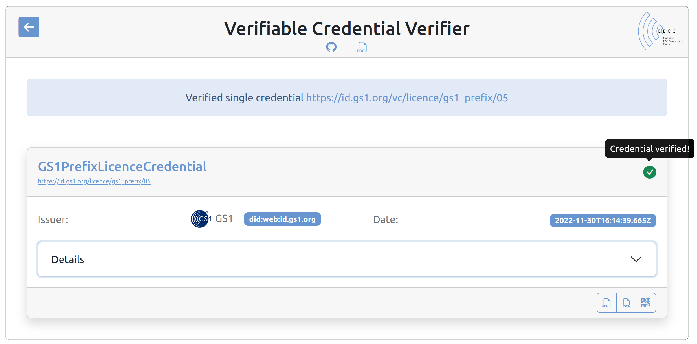
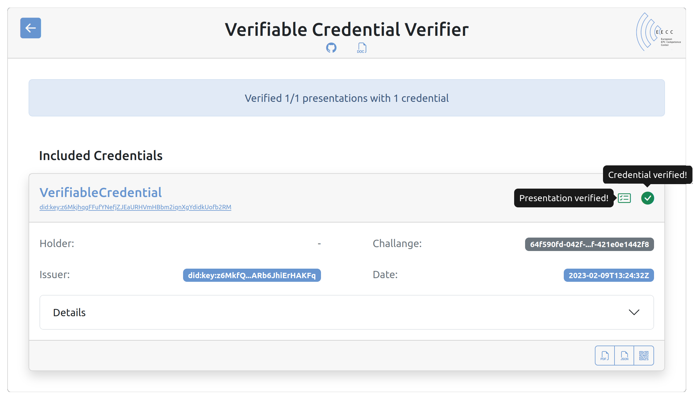

[](https://github.com/european-epc-competence-center/vc-verifier/actions)
[](https://github.com/orgs/european-epc-competence-center/packages?repo_name=vc-verifier)

<div align="center">
  <p>
    <a href="https://ssi.eecc.de/verifier">
      
    </a>
  </p>
</div>

# VC Verifier

The [EECC VC Verifier](https://ssi.eecc.de/verifier/) verifies [W3C Verifiable Credentials](https://www.w3.org/TR/vc-data-model/) (JSON-LD and JWT formats) and presentations using cryptographic signature verification and revocation checking. It includes a REST API and a web UI that aggregates credential data into a readable product passport view.

## Repository Structure

```
vc-verifier/
├── api/          # TypeScript/Express verification API
│   ├── src/      # Source code
│   ├── __tests__ # Jest tests
│   └── Dockerfile
├── frontend/     # Vue.js 3 web UI
│   └── Dockerfile
├── assets/       # Images for README and UI
├── docker-compose.yml
└── .github/workflows/  # CI: tests.yml, build-all.yml
```

## Usage

**Deployed instance**: https://ssi.eecc.de/verifier/

**API docs (Swagger)**: https://ssi.eecc.de/api/verifier/swagger/

### Local setup

```bash
# Start both services
docker-compose up
```

Or run individually for development:

```bash
cd api && npm install && npm run dev      # API on port 3000
cd frontend && npm install && npm run dev # UI on port 8080
```

Environment variables (see `docker-compose.yml` for defaults):
- `VC_REGISTRY` — credential registry URL
- `VUE_APP_VERIFIER_API` — API base URL (frontend)
- `OPENID_ENDPOINT` — OpenID4VP endpoint URL (frontend)

## Features

### Credential Selection

Credentials can be submitted for verification in four ways:

1. **Upload** — JSON file(s) containing a credential, presentation, or array of either; or a TXT file with a JWT token
2. **Paste** — paste a JWT token or JSON-LD credential/presentation as plain text (toggle "File Upload" → "Text Input")
3. **Credential ID** — provide a URL that resolves to the credential; the verifier fetches and verifies it
4. **Subject ID** — provide a subject identifier; the verifier queries the credential registry for all associated credentials

Each input field has a QR scanner button to scan credentials from a device camera.



### Presentation Request (OpenID4VP)

Click the send/arrow button (top right of the selector) to open the Presentation Request page. This generates a QR code encoding an [OpenID4VP](https://openid.net/specs/openid-4-verifiable-presentations-1_0.html) presentation request. A compatible wallet app can scan the QR code and submit a presentation, which is then automatically verified and displayed.

- Select "Any Credential" to accept any credential type, or "Custom Credential" to specify one or more credential types
- The verifier polls for the wallet's response and redirects to the results view once received



### Credential Verification

For each credential the verifier:
- Verifies the cryptographic signature using the issuer's public key (resolved via DID)
- Checks revocation/suspension status if a `credentialStatus` field is present
- Displays the result with issuer, validity dates, and credential subject data

Supported proof types: `Ed25519Signature2018`, `Ed25519Signature2020`, `JsonWebSignature2020` (ES256), and `DataIntegrityProof` with `eddsa-rdfc-2022`, `ecdsa-rdfc-2019`, `rsa-rdfc-2025`, `ecdsa-sd-2023` cryptosuites. JWT-format credentials (VC-JWT) are also supported.

Supported status types: `StatusList2021Entry`, `BitstringStatusListEntry`, `RevocationList2020Status`.



### Presentation Verification

Verifying a presentation checks the presentation proof and all contained credentials independently. A successfully verified presentation can contain revoked credentials.



### GS1 Trust Ecosystem Verification

The `/api/verifier/gs1` endpoint verifies credentials from the [GS1 Digital License ecosystem](https://www.gs1.org/services/verified-by-gs1) using the [`@eecc/vc-verifier-rules`](https://github.com/european-epc-competence-center/vc-verifier-rules) library, which adds GS1-specific validation on top of standard cryptographic verification:

- **JSON Schema validation** against GS1 credential schemas (key, company prefix, prefix, product data, organization data)
- **Trust chain verification**: the library recursively loads and cryptographically verifies the full chain of chained GS1 credentials (e.g., GS1 prefix licence → company prefix → key credential), using this verifier's own signature checking for each link
- **GS1 business rules**: license delegation rules and credential type constraints

The GS1 verifier first performs full standard verification (signature + status), then runs the GS1 rules. Results include both the standard `results` array and a `gs1Result` object with any rule violations and error codes.

**Example**: [GS1 prefix credential 05](https://ssi.eecc.de/verifier/#/verify?credentialId=https%3A%2F%2Fid.gs1.org%2Fvc%2Flicence%2Fgs1_prefix%2F05)

### Credential Retrieval

Verified credentials can be downloaded as a rendered PDF, raw JSON, or as a QR code image using the buttons at the bottom right of each credential card.

## Examples

- **Verified Product Passport**: https://id.eecc.de/01/04012345999990/10/20210401-A/21/XYZ-1234
- **GS1 Prefix Credential**: https://id.gs1.org/vc/licence/gs1_prefix/05
- **Revoked Credential**: https://ssi.eecc.de/api/registry/vc/0a720a69-34f0-4ed0-b767-a0a5f9212020

## License

Copyright 2022-2025 European EPC Competence Center GmbH (EECC). Corresponding Author: Christian Fries <christian.fries@eecc.de>

<a href="https://www.gnu.org/licenses/agpl-3.0.html">
<br />
</a>

All code published in this repository is free software: you can redistribute it and/or modify it under the terms of the GNU General Public License as published by the Free Software Foundation, either version 3 of the License, or (at your option) any later version.

This program is distributed in the hope that it will be useful, but WITHOUT ANY WARRANTY; without even the implied warranty of MERCHANTABILITY or FITNESS FOR A PARTICULAR PURPOSE. See the GNU General Public License for more details.
