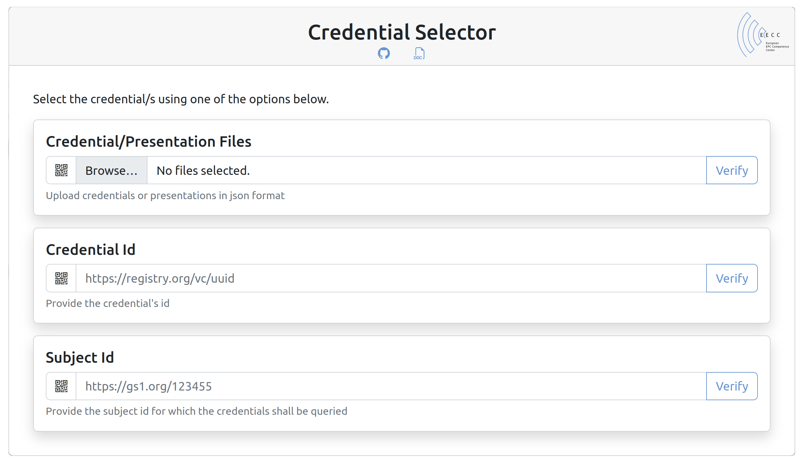

  <!-- PROJECT LOGO -->
  

    
  

# VC Verifier

The [EECC VC Verifier](https://ssi.eecc.de/verifier/) for Verifiable Credentials (VCs) provides a verification API as well as the corresponding UI. Its primary purpose is to aggregate data from various VCs and display them in a comprehensible manner as a product passport. [See here for an example.](https://ssi.eecc.de/verifier/#/verify?subjectId=https%3A%2F%2Fid.eecc.de/01/04012345999990/10/20210401-A/21/XYZ-1234)

This tool uses the libraries by [Digital Bazaar, Inc.](https://github.com/digitalbazaar), in particular

- https://github.com/digitalbazaar/vc
- https://github.com/digitalbazaar/ed25519-signature-2020
- https://github.com/digitalbazaar/vc-revocation-list
- https://github.com/digitalbazaar/vc-status-list
- https://github.com/digitalbazaar/ecdsa-sd-2023-cryptosuite

in order to verify signatures of [W3C conformal verifiable credentials](https://www.w3.org/TR/vc-data-model/) in JSON-LD form.

## Functionalities

### Credential Selection

1. **Upload credential**

    Uploading credentials als files must be done in form of verifiables, i.e. the [plain credential](https://www.w3.org/TR/vc-data-model/#credentials) or a [credential presentation](https://www.w3.org/TR/vc-data-model/#presentations). The upload can consist of multiple files and their content can be both single verifiables or arrays of verifiables.

2. **Reference credential**

    The given credential id URI must resolve to the credential itself. If so, the credential gets fetched and then verified.

3. **Query credentials**
   
    When passing an IRI/URI of a credential subject into the credential subject field, the verifier service queries the predefined verifiable [credential registry](https://w3c.github.io/did-spec-registries/#credentialregistry). All found credentials associated with the given subject id will get verified and presented according to the credential context.  
    

When using the scanner option to transfer the data, the service will start the verification right away without further user interaction.

## Verification

### Credential

When a credential gets verified, the verifier service checks the signature over the credential using the issuer's public key. Further it checks, if the credential has been revoked in case it is revokable. If both holds true, the credential is displayed as verified (see below)

### Presentation

Verification of a presentation includes the full verification of the contained credentials as such, as well as the verification of the presentation itself. Both verifications are separate operations, i.e. a successfully verified presentation can contain revoked, but no unverified credentials.

## Credential Retrieval

Each credential can be obtained in various ways using the buttons at the bottom right of the particular credential. It can either be downloaded as a rendered PDF file, as pure data in JSON format or as a QR-Code image.

## Examples

- **Example Credential** [https://id.gs1.org/vc/licence/gs1_prefix/05](https://ssi.eecc.de/verifier/#/verify?credentialId=https%253A%252F%252Fid.gs1.org%252Fvc%252Flicence%252Fgs1_prefix%252F05)
- **Verified Product Passport** https://id.eecc.de/01/04012345999990/10/20210401-A/21/XYZ-1234
- **Revoked Credential** https://ssi.eecc.de/api/registry/vc/0a720a69-34f0-4ed0-b767-a0a5f9212020

## License

Copyright 2022-2025 European EPC Competence Center GmbH (EECC). Corresponding Author: Christian Fries <christian.fries@eecc.de>

<a href="https://www.gnu.org/licenses/agpl-3.0.html">
 
</a>

All code published in this repository is free software: you can redistribute it and/or modify it under the terms of the
GNU General Public License as published by the Free Software Foundation, either version 3 of the License, or
(at your option) any later version.
</a>

This program is distributed in the hope that it will be useful, but WITHOUT ANY WARRANTY; without even the implied
warranty of MERCHANTABILITY or FITNESS FOR A PARTICULAR PURPOSE. See the GNU General Public License for more details.
